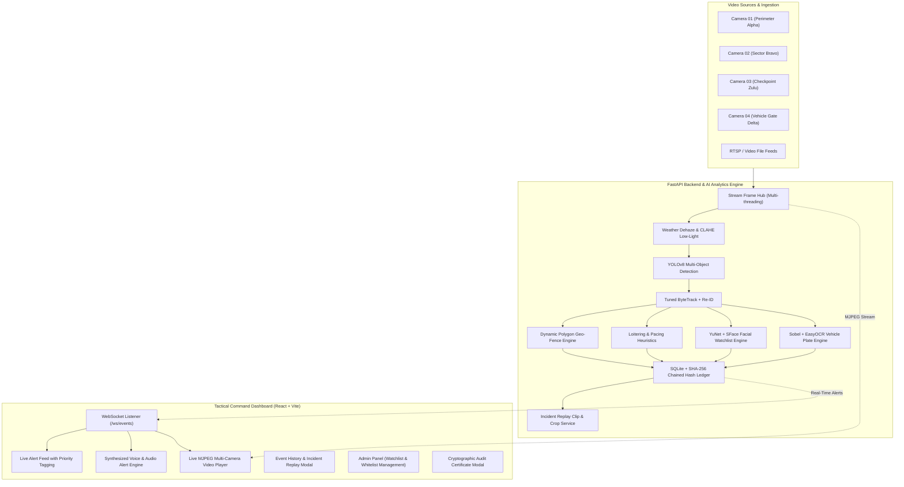

# IBVAP – Intelligent Border Video Analytics Platform

[](https://fastapi.tiangolo.com)
[](https://react.dev)
[](https://vitejs.dev)
[](https://ultralytics.com)
[](https://opencv.org)
[](https://developer.mozilla.org/en-US/docs/Web/API/WebSockets_API)
[](#cryptographic-tamper-evident-audit-trail)
[](LICENSE)

> **Smart India Hackathon 2026**  
> An automated, military-grade AI-powered border surveillance and video analytics platform engineered to process real-time multi-camera feeds, detect critical security events (unauthorized intrusion, anomalous vehicle movement, loitering, breach of dynamic virtual fences), maintain a tamper-evident audit trail, and deliver actionable situational awareness with instant voice alerts to command personnel.

---

## Table of Contents

- [Executive Summary](#executive-summary)
- [System Architecture](#system-architecture)
- [Key Capabilities & Modules](#key-capabilities--modules)
  - [1. Multi-Object Detection & ByteTrack Tracking](#1-multi-object-detection--bytetrack-tracking)
  - [2. Multi-Stream Ingestion & Live Switching Hub](#2-multi-stream-ingestion--live-switching-hub)
  - [3. Dynamic Virtual Fence (Polygon Geo-Fencing)](#3-dynamic-virtual-fence-polygon-geo-fencing)
  - [4. Appearance Re-Identification (Re-ID)](#4-appearance-re-identification-re-id)
  - [5. Low-Light Nocturnal & Weather-Adaptive Dehazing](#5-low-light-nocturnal--weather-adaptive-dehazing)
  - [6. Behavioral Anomaly Detection](#6-behavioral-anomaly-detection)
  - [7. Watchlist Facial Recognition (Consented Demo)](#7-watchlist-facial-recognition-consented-demo)
  - [8. ANPR & Authorized Vehicle Whitelisting](#8-anpr--authorized-vehicle-whitelisting)
  - [9. Cryptographic Tamper-Evident SHA-256 Audit Trail](#9-cryptographic-tamper-evident-sha-256-audit-trail)
  - [10. Incident Video Replay & Evidence Extraction](#10-incident-video-replay--evidence-extraction)
  - [11. Real-Time WebSockets & Voice Alert Audio Engine](#11-real-time-websockets--voice-alert-audio-engine)
- [Repository Directory Structure](#repository-directory-structure)
- [Technology Stack](#technology-stack)
- [REST & WebSocket API Reference](#rest--websocket-api-reference)
- [Installation & Getting Started](#installation--getting-started)
  - [Prerequisites](#prerequisites)
  - [Backend Setup (FastAPI & AI Engines)](#backend-setup-fastapi--ai-engines)
  - [Frontend Setup (React + Vite Tactical UI)](#frontend-setup-react--vite-tactical-ui)
- [Running the Platform](#running-the-platform)
  - [1. Launch Backend Server](#1-launch-backend-server)
  - [2. Launch Frontend Tactical Dashboard](#2-launch-frontend-tactical-dashboard)
  - [3. Standalone Verification & Pipeline Demos](#3-standalone-verification--pipeline-demos)
  - [4. Real-Time Git Auto-Sync](#4-real-time-git-auto-sync)
- [Ethical & Legal Compliance Disclaimer](#ethical--legal-compliance-disclaimer)

---

## Executive Summary

Border security requires high-precision, low-latency automated surveillance capable of processing 24/7 video streams under harsh environmental conditions (fog, nocturnal darkness, rain). **IBVAP** bridges cutting-edge computer vision (YOLOv8, tuned ByteTrack, YuNet/SFace, EasyOCR) with an enterprise-grade tactical command dashboard.

### Core Value Propositions:
- **Instant Situational Awareness:** Live MJPEG video feeds with dynamic bounding boxes, polygon security zones, and real-time audio chime + synthesized voice alerts.
- **Precision Tracking & Anti-Occlusion:** High-fidelity multi-camera tracking with HSV chromatic histogram Re-ID and spatial-temporal bounding association.
- **Zero-Trust Event Logging:** Every security breach is cryptographically chained via continuous SHA-256 hashing to guarantee forensic non-repudiation.
- **Instant Incident Replay:** Operators can click any alert to extract and review pre/post-event incident video clips and high-resolution target crops.
- **Granular Access Control:** Role-Based Access Control (Admin vs. Operator) protecting sensitive settings, watchlist databases, and audit verification certificates.

---

## System Architecture



---

## Key Capabilities & Modules

### 1. Multi-Object Detection & ByteTrack Tracking
- Powered by **Ultralytics YOLOv8** coupled with custom-tuned **ByteTrack** parameters (`backend/app/bytetrack_tuned.yaml`).
- Detects, classifies, and tracks `person`, `car`, `truck`, `bus`, `motorcycle`, and unexpected animal movements.
- Minimum track hysteresis debouncing prevents momentary detection flickers from generating false positive alarm storms.

### 2. Multi-Stream Ingestion & Live Switching Hub
- Implemented in `backend/app/stream_hub.py` via an asynchronous, thread-safe frame buffer.
- Supports switching live feeds dynamically across registered surveillance cameras (`CAM_01` through `CAM_04`) and on-demand video files.
- Provides standard MJPEG video streaming endpoints (`/api/live-feed/{camera_id}`) and single-frame snapshots for ultra-low latency playback in modern web browsers without heavy media plugins.

### 3. Dynamic Virtual Fence (Polygon Geo-Fencing)
- Real-time ray-casting Point-In-Polygon (PIP) algorithms evaluate tracked object centroids against arbitrary security zone geometries.
- Features a **3-frame hysteresis state machine**: requires persistent presence before triggering a breach and prevents bouncing at boundary edges.
- Generates categorized `CRITICAL` perimeter intrusion security events.

### 4. Appearance Re-Identification (Re-ID)
- Retains track identity when subjects are momentarily occluded behind terrain, vehicles, or border structures.
- Combines normalized HSV-weighted chromatic histograms with spatial-temporal bounding box predictions to reconnect broken trajectories.

### 5. Low-Light Nocturnal & Weather-Adaptive Dehazing
- **Nocturnal CLAHE Enhancement**: Automatically computes mean luminance; applies Contrast Limited Adaptive Histogram Equalization on the CIELAB Lightness ($L^*$) channel when nocturnal conditions are detected.
- **Weather Dehazing**: Employs Dark Channel Prior (DCP) optical attenuation modeling to penetrate heavy border fog, dust storms, and heavy rain.

### 6. Behavioral Anomaly Detection
- Analyzes trajectory coordinate histories over temporal sliding windows:
  - **Loitering Detection**: Flags targets lingering in high-risk zones longer than configurable threshold limits (e.g., > 10 seconds).
  - **Oscillating Horizontal Pacing**: Detects repetitive back-and-forth movement signatures indicative of patrol surveillance or scouting behavior.

### 7. Watchlist Facial Recognition (Consented Demo)
- Utilizes OpenCV DNN **YuNet** for ultra-fast face detection & 5-point landmark alignment.
- Computes 128-dimensional deep feature embeddings using **SFace**.
- Performs cosine similarity matching against registered authorized personnel in `backend/watchlist/`.
- Includes one-click biometric re-indexing and live photo enrollment via the Admin Panel.

### 8. ANPR & Authorized Vehicle Whitelisting
- Edge-based morphological localization and Sobel gradient filtering identify vehicle license plate regions.
- **EasyOCR** extracts alphanumeric plate strings with clean regex parsing.
- Cross-references plates against the internal Authorized Vehicle Database (`backend/app/admin_management.py`):
  - **Authorized Vehicles**: Flagged as legitimate patrol / supply vehicles (`LOW` priority log).
  - **Unregistered Vehicles**: Escalate immediately to `HIGH` or `CRITICAL` security alerts.

### 9. Cryptographic Tamper-Evident SHA-256 Audit Trail
- To eliminate insider tampering or log falsification, events are stored in a continuous blockchain-style hash chain:
  $$\text{Hash}_i = \text{SHA-256}(\text{Hash}_{i-1} \parallel \text{Timestamp} \parallel \text{CameraID} \parallel \text{EventType} \parallel \text{Payload})$$
- Starts from a fixed cryptographic genesis block.
- Endpoint `/api/audit/verify` re-evaluates the entire ledger from genesis to verify chain integrity.
- Endpoint `/api/audit/certificate` produces a cryptographically signed, downloadable audit certificate for courtroom and tribunal admissibility.

### 10. Incident Video Replay & Evidence Extraction
- For every logged security event, `backend/app/replay_service.py` automatically slices a focused pre/post-event MP4 clip (e.g., 4 seconds prior to 4 seconds post event).
- Extracts a high-resolution target crop image highlighting the exact subject/vehicle that triggered the alarm.
- Accessible directly from the dashboard event history table.

### 11. Real-Time WebSockets & Voice Alert Audio Engine
- FastAPI manages concurrent WebSocket connections on `/ws/events`, multicasting alerts to all active command terminals in `< 50ms`.
- Frontend includes an intelligent **Voice Alert Synthesizer** (`frontend/src/services/voiceAlertService.js`):
  - Prioritizes `CRITICAL` alerts over lower priority items.
  - Synthesizes clear, audible speech warnings (e.g., *"Warning: Perimeter breach detected on Sector Alpha, Camera 01"*).
  - Preceded by a high-frequency tactical audio chime with queue deduplication and user volume/mute controls.

---

## Repository Directory Structure

```
IBVAP/
├── backend/
│   ├── app/
│   │   ├── admin_management.py         # Watchlist & vehicle whitelist DB handlers
│   │   ├── auth.py                     # JWT token generation, bcrypt, and RBAC guards
│   │   ├── bytetrack_tuned.yaml        # Tuned ByteTrack configuration file
│   │   ├── detection_tracking.py       # YOLOv8 + ByteTrack + Re-ID + Geo-Fence core
│   │   ├── events.py                   # SQLite schema, SHA-256 chained audit ledger
│   │   ├── face_engine.py              # YuNet + SFace biometric recognition engine
│   │   ├── main.py                     # FastAPI server, REST routes & WebSocket hub
│   │   ├── replay_service.py           # Pre/post incident clip and crop generator
│   │   ├── stream_hub.py               # Multi-camera frame ingestion & MJPEG streamer
│   │   ├── test_detection.py           # Verification script for local video tests
│   │   └── weather_enhancement.py      # CLAHE & Dark Channel Prior dehaze filters
│   ├── models/                         # YOLOv8n, YuNet, and SFace ONNX weight files
│   ├── snapshots/                      # Stored event snapshot JPEGs
│   ├── test_videos/                    # Sample test clips (perimeter, night, traffic)
│   ├── watchlist/                      # Enrolled face images for authorized personnel
│   ├── requirements.txt                # Python backend dependencies
│   └── ibvap.db                        # SQLite database (events, audit, users, whitelist)
├── frontend/
│   ├── public/                         # Public assets and favicon
│   ├── src/
│   │   ├── components/
│   │   │   ├── AdminPanel.jsx          # Personnel watchlist & vehicle whitelist UI
│   │   │   ├── CameraPanel.jsx         # Camera status & stream switcher
│   │   │   ├── EventHistory.jsx        # Searchable event table, replay & audit cert
│   │   │   ├── Header.jsx              # Status indicators, clock & user profile
│   │   │   ├── LiveAlertFeed.jsx       # Real-time scrolling alert notification feed
│   │   │   ├── LiveVideoFeed.jsx       # Interactive video player with live stream switch
│   │   │   ├── LoginPage.jsx           # Tactical biometric-style login page
│   │   │   ├── SnapshotModal.jsx       # Full-resolution evidence & replay viewer
│   │   │   └── StatsRow.jsx            # Real-time KPI summary counter cards
│   │   ├── context/
│   │   │   └── AuthContext.jsx         # User auth state, tokens & permissions
│   │   ├── services/
│   │   │   ├── api.js                  # Axios/fetch API communication layer
│   │   │   └── voiceAlertService.js    # TTS voice alerts & priority audio queue
│   │   ├── App.jsx                     # Main tactical layout assembler
│   │   ├── index.css                   # Cyberpunk / tactical dark-mode design system
│   │   └── main.jsx                    # React application root entrypoint
│   ├── package.json                    # Frontend dependencies & scripts
│   └── vite.config.js                  # Vite configuration & dev proxy
├── auto_git_sync.ps1                   # Real-time PowerShell background auto-sync
├── auto_git_sync.bat                   # 1-click batch launcher for auto-sync
├── sync_now.bat                        # 1-click immediate manual push launcher
├── .gitignore
└── README.md
```

---

## Technology Stack

| Domain | Technology | Purpose |
|---|---|---|
| **Computer Vision** | **Ultralytics YOLOv8** | Real-time object detection and classification |
| **Object Tracking** | **ByteTrack + Re-ID** | Spatial-temporal tracking & appearance histograms |
| **Biometrics** | **YuNet + SFace (ONNX)** | 5-point landmark face detection & 128-d cosine matching |
| **OCR** | **EasyOCR + OpenCV** | License plate localization & text recognition |
| **Image Enhancement** | **CLAHE + DCP Dehaze** | Nocturnal low-light & weather-adaptive vision |
| **Backend Framework** | **FastAPI + Uvicorn** | High-throughput asynchronous REST API & WebSockets |
| **Database & Audit** | **SQLite + SHA-256** | Chained tamper-evident cryptographic event logging |
| **Frontend Framework**| **React 18 + Vite** | High-performance tactical operator interface |
| **Styling & Icons** | **Custom CSS + Lucide**| Ultra-dark military tactical UI with glassmorphism |
| **Audio Engine** | **Web Speech API** | Synthesized tactical voice alerts and notification chime |

---

## REST & WebSocket API Reference

### Authentication & RBAC
| Method | Endpoint | Description |
|---|---|---|
| `POST` | `/api/auth/login` | Authenticate with credentials and receive JWT bearer token |
| `GET` | `/api/auth/me` | Retrieve profile and role permissions of current user |
| `GET` | `/api/auth/config` | Retrieve current authentication system configuration |

### Security Events & Forensic Audit
| Method | Endpoint | Description |
|---|---|---|
| `GET` | `/api/events` | List security events (supports filtering by camera, severity, type) |
| `GET` | `/api/events/{id}` | Get detailed data for a specific security event |
| `GET` | `/api/snapshots/{id}`| Retrieve high-resolution evidence snapshot JPEG |
| `GET` | `/api/events/{id}/replay` | Stream or download pre/post-event incident MP4 replay clip |
| `GET` | `/api/events/{id}/crop` | Retrieve high-resolution cropped bounding box of target |
| `GET` | `/api/audit/verify` | Re-verify cryptographic SHA-256 hash chain from genesis block |
| `GET` | `/api/audit/certificate` | Generate downloadable cryptographic audit proof certificate |

### Live Video Feeds & Stream Hub
| Method | Endpoint | Description |
|---|---|---|
| `GET` | `/api/live-feed/{camera_id}` | Stream real-time low-latency MJPEG video feed |
| `GET` | `/api/live-feed/{camera_id}/frame` | Fetch current raw frame JPEG for a specific camera |
| `GET` | `/api/stream/videos` | List available test video files for simulation |
| `POST` | `/api/stream/start` | Launch live AI tracking on a specific video source or camera |
| `POST` | `/api/stream/stop` | Stop active tracking stream pipeline |
| `GET` | `/api/stream/status` | Query active tracking status and source metadata |

### Cameras, Stats & Health
| Method | Endpoint | Description |
|---|---|---|
| `GET` | `/api/cameras` | List all registered surveillance cameras and online heartbeats |
| `GET` | `/api/stats` | Summary KPI metrics (total breaches, active alerts, cameras) |
| `GET` | `/api/system/health` | System diagnostics, memory, GPU/CPU usage & database status |

### Admin Management
| Method | Endpoint | Description |
|---|---|---|
| `GET` | `/api/admin/watchlist` | List registered personnel in biometric watchlist |
| `POST` | `/api/admin/watchlist` | Enroll new person with portrait photo upload |
| `DELETE` | `/api/admin/watchlist/{name}` | Remove individual from biometric watchlist |
| `POST` | `/api/admin/watchlist/rescan` | Trigger facial engine embedding re-computation |
| `GET` | `/api/admin/vehicles` | List authorized vehicles on whitelist |
| `POST` | `/api/admin/vehicles` | Add or update authorized vehicle license plate |
| `DELETE` | `/api/admin/vehicles/{plate}` | Delete vehicle license plate from whitelist |

### Real-Time WebSockets
| Protocol | Endpoint | Description |
|---|---|---|
| `WS` | `/ws/events` | Bi-directional WebSocket stream for sub-50ms security alerts |

---

## Installation & Getting Started

### Prerequisites
- **Python**: 3.10 or higher
- **Node.js**: v18.0.0 or higher (with `npm`)
- **Git**: Installed and configured
- **OS**: Windows 10/11, Ubuntu 22.04+, or macOS

---

### Backend Setup (FastAPI & AI Engines)

1. **Clone the repository:**
   ```bash
   git clone https://github.com/kunalvish08/IBVAP.git
   cd IBVAP
   ```

2. **Create and activate a Python virtual environment:**
   ```bash
   # Windows PowerShell:
   python -m venv backend/.venv
   backend\.venv\Scripts\Activate.ps1

   # Linux / macOS:
   python3 -m venv backend/.venv
   source backend/.venv/bin/activate
   ```

3. **Install Python dependencies:**
   ```bash
   pip install --upgrade pip
   pip install -r backend/requirements.txt
   ```

4. **Verify YOLOv8 Model Weights:**
   The base weight file `yolov8n.pt` will automatically download on first run if not already present in the project root.

---

### Frontend Setup (React + Vite Tactical UI)

1. **Navigate to the frontend directory:**
   ```bash
   cd frontend
   ```

2. **Install Node.js dependencies:**
   ```bash
   npm install
   ```

---

## Running the Platform

### 1. Launch Backend Server

From the project root (with virtual environment activated):

```bash
# Windows:
python -m uvicorn backend.app.main:app --host 0.0.0.0 --port 8000 --reload

# Or run directly inside backend/app:
cd backend/app
python -m uvicorn main:app --host 0.0.0.0 --port 8000 --reload
```
The API documentation will be interactively available at:
- **Swagger UI**: `http://localhost:8000/docs`
- **ReDoc**: `http://localhost:8000/redoc`

---

### 2. Launch Frontend Tactical Dashboard

In a separate terminal, navigate to the `frontend/` directory:

```bash
cd frontend
npm run dev
```

Open your browser and navigate to:
```
http://localhost:5173
```

- **Default Admin Account**: `admin` / `admin123`
- **Default Operator Account**: `operator` / `operator123`

---

### 3. Standalone Verification & Pipeline Demos

Run automated standalone test verification scripts to benchmark vision and tracking pipelines:

```bash
# Test YOLOv8 video detection on sample video:
python backend/app/test_detection.py

# Benchmark weather dehazing & low-light enhancements:
python backend/app/benchmark_weather_dehaze.py

# Verify SHA-256 chained audit trail tamper detection:
python backend/app/test_audit_certificate.py

# Run E2E Admin Panel and whitelist verification:
python backend/app/test_e2e_admin_phase_a.py
```

---

### 4. Real-Time Git Auto-Sync

For collaborative hackathon environments where team members continuously push updates:

- **1-Click Launch**: Double-click `auto_git_sync.bat` in the repository root.
- **Immediate Push**: Double-click `sync_now.bat` to immediately stage, commit, and push changes to GitHub.
- **PowerShell Script**:
  ```powershell
  powershell -ExecutionPolicy Bypass -File ./auto_git_sync.ps1
  ```

---

## Ethical & Legal Compliance Disclaimer

> [!IMPORTANT]
> **Consented Demo Biometrics Only:**
> The facial identification and license plate recognition capabilities included in IBVAP are strictly engineered as educational proof-of-concept demonstrations.
>
> - Biometric facial matching evaluates exclusively against small, local, consented demo watchlists (`backend/watchlist/`).
> - The platform is **NOT** connected to any real-world law enforcement, governmental, or public surveillance database.
> - Real-world deployment of autonomous border video analytics requires formal statutory authorization, adherence to international human rights standards, data privacy compliance, and judicial oversight frameworks.

---

<div align="center">
  <b>Developed for Smart India Hackathon 2026</b><br>
  <i>Engineered with precision for secure, intelligent, and tamper-evident border surveillance.</i>
</div>
